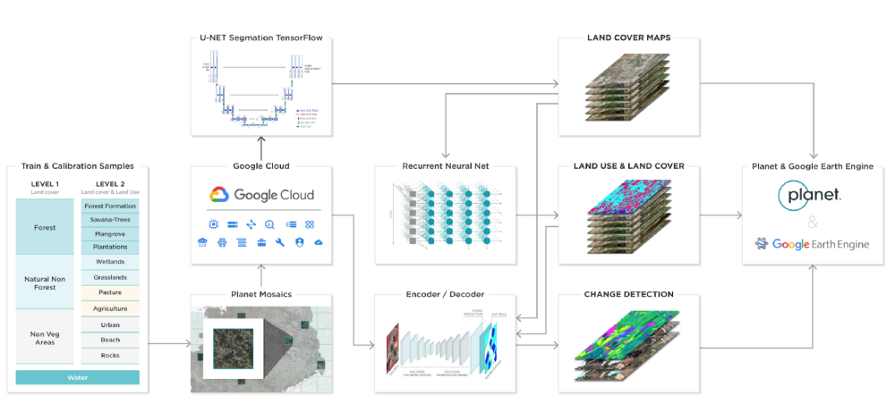

## 行业
[AgFunder](https://agfundernews.com/agfunder-opens-new-fund-to-investors.html/) 是美国的农业众筹网站，为农业生产项目和技术项目提供股权众筹服务。10月底，AgFunder 开始其[新的募资基金](https://agfundernews.com/agfunder-opens-new-fund-to-investors.html/)，面向非美国投资者。它官网的[项目库](https://agfunder.com/listings)里可以看到一些新出来的技术和产品，比如南非的 [Aerobotics.io](https://www.aerobotics.io/) ，森林病害管理的影像分析和无人机巡查。

## 公司
Planet 在巴西开展 [NexGenMap](https://www.lapig.iesa.ufg.br/lapig/nextgenmap-data/) 项目，使用 Planet 数据来实时更新巴西16 处 30w 平方公司的森林覆被变化，[GitHub Repo](https://github.com/NexGenMap/tutorial-sessions)。

[SpatialKey](http://www.spatialkey.com/) 是一家为保险公司提供地理数据服务的第三方公司。2月，总部位于美国丹佛的SpatialKey和瑞再达成合作协议，他们将会引入瑞再的CatNet风险数据库到自己的平台上，从而为保险公司提供多达十类的灾害数据，包括洪灾、地震、海啸、冰雹等。

[Vandersat](https://www.vandersat.com/) 荷兰一家公司，卫星监测 100 x 100 m 的土壤含水量分布和作物长势，提供 API 和手机 App。可提供最新 6 小时前的监测数据。数据库中积累 40 年来的水温数据。为农场主安排生产，以及帮助保险公司预测环境风险防范。目前与瑞再合作开发基于天气参数的农业保险产品，发布在其农场管理平台 [optic-crop](https://www.youtube.com/watch?v=K7TQn6bPsMI) 上。

[indigoag](https://www.indigoag.com/) 使用微生物技术帮助作物生长，包括棉花、玉米、小麦、大豆和水稻。自 17 年开始，有 50 家美国大农场开始使用[它们的微生物产品](https://agfundernews.com/indigo-ag-makes-bid-to-become-agtech-marketplace.html/)，在市场上共募得 4 亿美金。

## 产品
[Granular Business Granular](https://granular.ag/farm-management-software/) 开发的农田管理软件。Granular 17年被杜邦公司收购，作价 3 亿。

## 学界
[eartharxiv.org](https://eartharxiv.org/) 上线三个月，类似 [ArXiv](https://arxiv.org/) ，Earth Scince 领域的 Preprints 网站。[这里](https://eartharxiv.github.io/faq.html)是它的 FAQ。被 Google Scholar 收录，作用类似会议论文。内容良莠不齐，但可以用于追踪一些活跃研究者的最新工作。 

