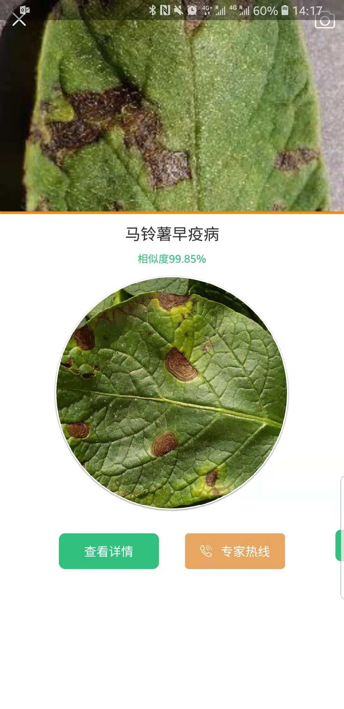

## 行业

## 公司

### Flurosat
澳大利亚农业遥感公司 [flurosat](https://www.flurosat.com/) 作物健康监测和农田管理系统。使用遥感影像与无人机数据，生成施肥处方图、水分胁迫图，近来收购了农业软件服务公司[ProductionWise](https://productionwise.com.au/). 

###  Onesoil
白俄罗斯的精准耕作公司[onesoil](https://onesoil.ai/en/) 基于sentienel-2微波数据，使用机器学习的算法识别全球地块信息，基于地块，可以开展分辨率无差别分析，调用public data上任意含有地理位置信息的数据（satellite，ground photo，weather），开展基于地块的精准农业分析。

###  Awhere
[awhere](http://www.awhere.com/) 气象估算平台，收集逾10亿个当地数据点（hyper-local），可以基于地理位置获取精确的气象预测。并提供多种气象产量估算模型API。

以色列精准农业公司 [taranis](http://www.taranis.ag/)，也是前段时间收购Mavrx的那家。作物估产、病害、除草和营养。 @明泉

### 农乐道 神农识

[农乐道](http://www.lenongdao.com/) [神农识](https://www.sndistinguish.com/) 农业病虫害识别。提供提供解决方案和农业咨询信息，打通农户和商户之间的联系。

## 产品
