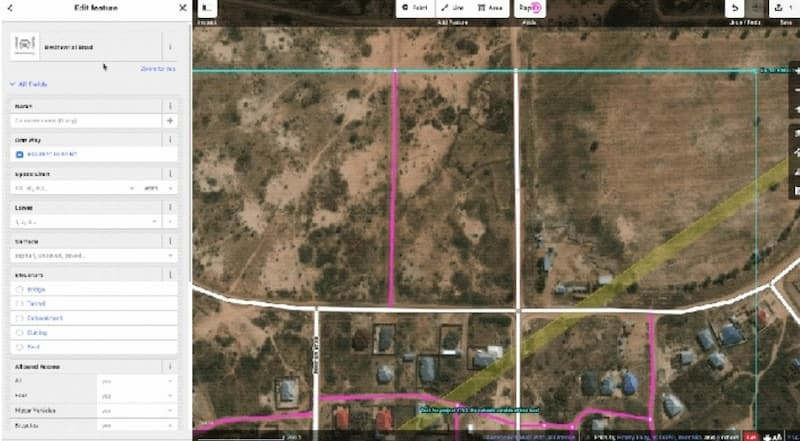
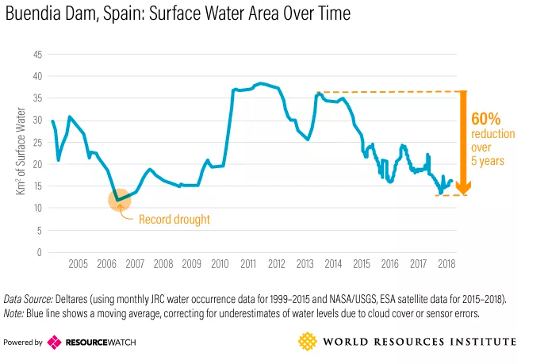
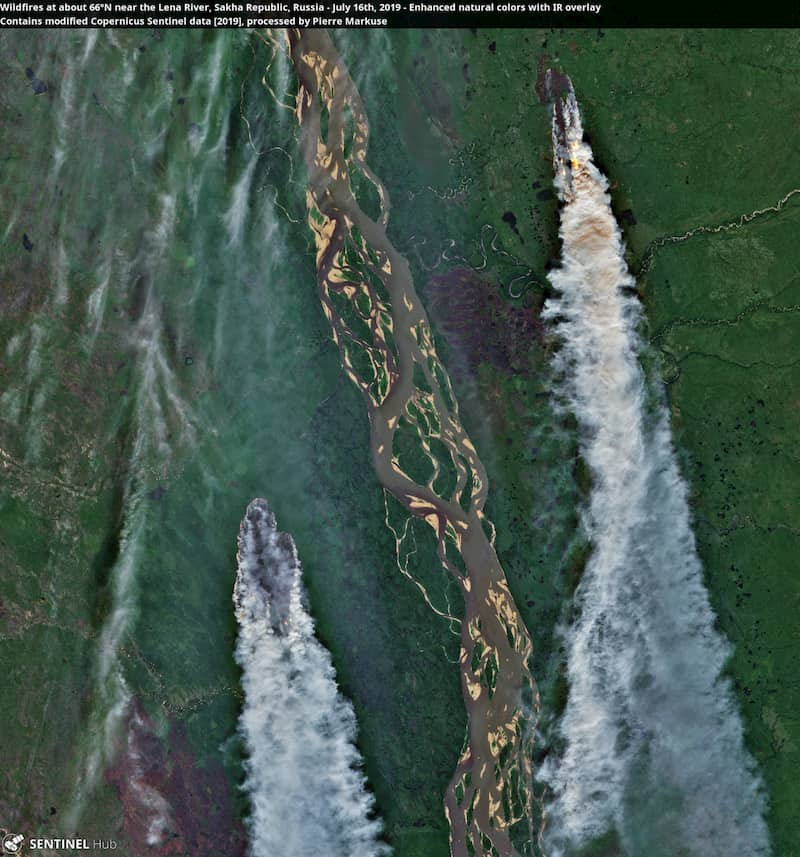
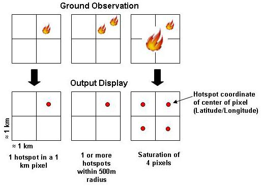
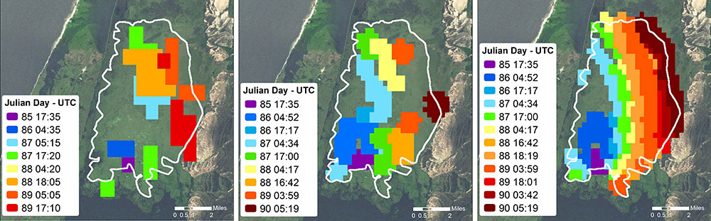

商业遥感观察第 3 期，这里记录每周值得分享的关于商业遥感、精准农业面的内容，周五发布。

欢迎投稿，或推荐你自己的项目，请前往 GitHub 的 [agtech-business-observations](https://github.com/suredream/agtech-business-observations/issues/new) 提交 issue。

## 行业

[ARD2019](https://www.ard.zone/ard19)  **Second ARD Workshop on Remote Sensing Data Interoperability**上周在 USGS menlo Park 召开。

[mapwith.ai](https://tech.fb.com/ai-is-supercharging-the-creation-of-maps-around-the-world/)

Facebook 开发了一个人工智能系统，可以从卫星照片自动生成地图。图中，白色线条是现有道路，粉红色线条是人工智能识别出来的道路。[这里](https://github.com/facebookmicrosites/Open-Mapping-At-Facebook/wiki/FAQ) 是它的 Wiki Page。

这套系统可以识别出上图中的河边小道，因此对地理信息不全的农村地区尤其有用。该系统已经补全了泰国和印尼现有地图缺失的道路，将泰国地图的道路总里程，从28万英里增加到了60万英里。

[[水库萎缩](https://www.geospatialworld.net/blogs/satellite-data-show-shrinking-reservoirs-that-may-spark-major-water-crisis-globally/)](https://www.geospatialworld.net/blogs/satellite-data-show-shrinking-reservoirs-that-may-spark-major-water-crisis-globally/) [世界资源研究所](http://www.wri.org.cn/about) 报告：印度、摩洛哥、伊拉克、西班牙等地的水库萎缩，旱情频发。

[北极大火](https://earther.gizmodo.com/satellite-images-show-vast-swaths-of-the-arctic-on-fire-1836500468) 北极圈内多个地点，从阿拉斯加、西伯利亚到格陵兰正在发生森林大火。今年6月，北极圈的气温是有史以来最高的，很多地方超过30度，异常闷热，干燥高温导致森林火灾，火灾会释放大量二氧化碳，进而引起气温进一步升高，引发了更多火灾。

## 公司

## 产品

[NASA 全球野火监测系统 FIRMS](https://earthdata.nasa.gov/learn/articles/wildfires-cant-hide-from-earth-observing-satellites) 隶属 NASA 陆面大气实地对地观测系统 LANCE，融合多个遥感数据源，全球覆盖，提供过去 24 小时、48 小时、一周的疑似火点结果。

MODIS 热点异常算法

1km Aqua/MODIS, 750m VIIRS, 375m VIIRS 火点图比较

## 学界

[专辑 Earth Observation Data Cubes](https://www.mdpi.com/journal/data/special_issues/EODC) 

# 阅读

如何

### 文档信息

- 版权声明：自由转载-非商用-非衍生-保持署名（[创意共享3.0许可证](http://creativecommons.org/licenses/by-nc-nd/3.0/deed.zh)）
- 发表日期： 2019年8月 12 日